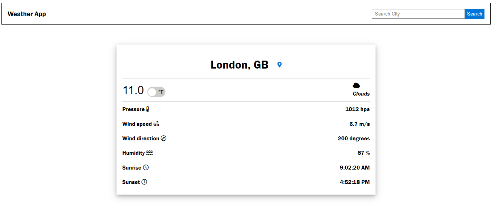

# Project: Weather-Report-App

> A Front-end web application that fetches the current weather data about a specified location/region/country using the http://api.openweathermap.org/ API.



## Live demo

🔗 [visit the page](https://confident-morse-0fa377.netlify.app/)

## Built With

- Javascript (ES6)
- HTML / CSS
- Font awesome icons
- Webpack

## Getting Started

To get a local copy up and running follow these simple steps.

### Prerequisites

In order for ```Weather-Report-App``` to work locally on your machine, you need these installations:
- Nodejs and npm
- Web Browser

### Install

1) Open the Terminal
2) Run

```sh
git clone https://github.com/belsman/Restaurant-Page.git
```

or, for SSH:

```sh
git clone git@github.com:belsman/Restaurant-Page.git
```

3) Run ```cd Weather-Report-App``` to enter the main directory
4) Run ```npm install```
5) Run ```npm run build```
6) Run ```cd dist/```
8) Open the ```index.html``` in your browser
9) Search for weather data in any region/city/country of choice
`

## Author

👤 **Bello Babakolo**

- Github: [@belsman](https://github.com/belsman)
- Twitter: [@d_belsman](https://twitter.com/d_belsman)
- Linkdin: [Bello Babakolo](https://www.linkedin.com/in/bello-babakolo-b23b17145/)


## 🤝 Contributing

Contributions, issues and feature requests are welcome!

Feel free to check the [issues page](issues/).

## Show your support

Give a ⭐️ if you like this project!

## Acknowledgments

- Microverse for showing the way for this project to happen
